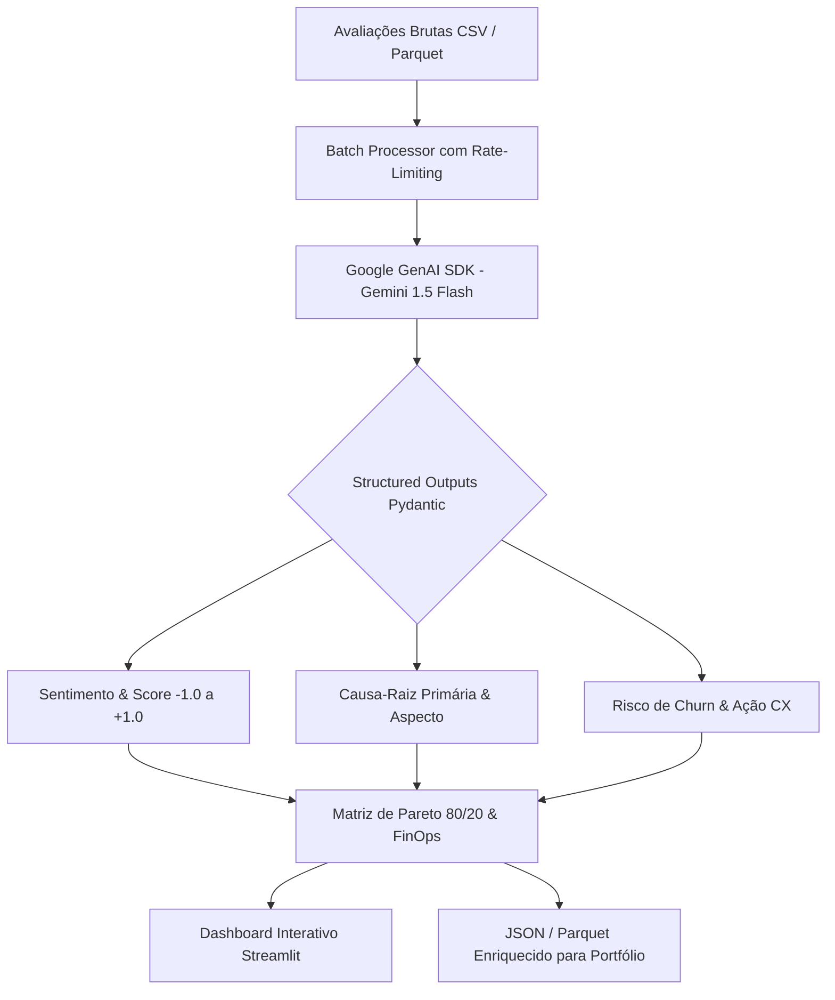

# 🎙️ Voz do Cliente (VoC) & Enriquecimento com IA (Gemini API & NLP)

[](https://github.com/Renanbritto/voz-do-cliente/actions/workflows/ci.yml)
[](https://www.python.org/)
[](https://ai.google.dev/)
[](https://docs.pydantic.dev/)
[](https://streamlit.io/)
[](https://opensource.org/licenses/MIT)

Plataforma analítica corporativa de ponta a ponta que utiliza **IA Generativa (Google Gemini 1.5 Flash)** com **Structured Outputs (Pydantic)** para transformar avaliações não estruturadas de e-commerce em inteligência acionável de produto, risco de churn e cálculo de impacto financeiro por **Diagrama de Pareto 80/20**.

---

## 🏛️ Arquitetura da Solução



---

## 🎯 Diferenciais Técnicos e de Negócio

1. **Structured Outputs Rigorosos (Zero Alucinação de JSON):**
   - O modelo é forçado a respeitar estritamente o contrato da classe `ReviewAnalysisResult` via Pydantic (`response_schema`), garantindo integração nativa com bancos de dados relacionais e data lakes.
2. **FinOps de Tokens em Tempo Real:**
   - Preços oficiais do Google AI Studio ($0.075 / 1M tokens de input e $0.300 / 1M tokens de output).
   - Custo médio por avaliação analisada: **~R$ 0,0002** (10.000 avaliações custam menos de R$ 2,00).
3. **Diagrama de Pareto 80/20 (Foco no Prejuízo):**
   - Cruza o volume de reclamações com o valor financeiro do SKU (R$) para identificar os **20% de defeitos que concentram 80% das perdas com devoluções e trocas**.
4. **Dashboard Streamlit com Gráficos Plotly:**
   - KPIs de negócio em tempo real (Taxa de Detratores, Prejuízo Mapeado, Custo FinOps).
   - Gráfico de Pareto composto com linha de corte em 80%.
   - Playground interativo para testar avaliações ao vivo com o modelo.

---

## 📂 Estrutura de Pastas

```text
voz-do-cliente/
├── .github/workflows/
│   └── ci.yml               # Pipeline de CI (Ruff + Pytest)
├── data/
│   ├── raw/                 # Avaliações originais (CSV)
│   └── enriched/            # Base enriquecida pela IA (JSON / Parquet)
├── src/
│   ├── ai/
│   │   ├── client.py        # Wrapper do Google GenAI SDK (Gemini 1.5 Flash)
│   │   ├── schemas.py       # Contratos Pydantic (Structured Outputs)
│   │   └── cost_calc.py     # Calculadora de FinOps de tokens (USD / BRL)
│   ├── pipeline/
│   │   ├── batch_processor.py # Processamento em lote com tratamento de erro
│   │   └── pareto_matrix.py   # Algoritmo de classificação ABC e Pareto 80/20
│   └── utils/
│       └── logger.py        # Logging estruturado com Rich
├── tests/
│   ├── test_schemas.py      # Validação de schemas e limites
│   ├── test_cost_calc.py    # Testes unitários do FinOps
│   └── test_pareto.py       # Testes da regra de Pareto 80/20
├── app.py                   # Aplicação Web Streamlit com Gráficos Plotly
├── main.py                  # CLI Executável para terminal
├── requirements.txt         # Dependências do projeto
├── .env.example             # Exemplo de configuração da GEMINI_API_KEY
└── README.md                # Documentação executiva
```

---

## 🚀 Como Executar

### 1. Clonar o repositório e criar o ambiente virtual
```bash
git clone https://github.com/Renanbritto/voz-do-cliente.git
cd voz-do-cliente

# Criar ambiente virtual
python -m venv .venv

# Ativar no Windows:
.venv\Scripts\activate
# Ativar no Linux/Mac:
source .venv/bin/activate

# Instalar dependências
pip install -r requirements.txt
```

### 2. Configurar a chave da API do Gemini
Crie um arquivo `.env` na raiz:
```env
GEMINI_API_KEY=sua_chave_do_google_ai_studio_aqui
```
*(Nota: se não configurar a chave, o projeto opera automaticamente em modo de simulação inteligente para demonstração offline).*

### 3. Rodar o Dashboard Streamlit (Interface Visual)
```bash
streamlit run app.py
```
Acesse no seu navegador: `http://localhost:8501`

### 4. Rodar pelo Terminal (Modo CLI)
```bash
# Executar o processamento em lote e gerar a matriz de Pareto:
python main.py

# Testar uma avaliação específica ao vivo:
python main.py --test "A bateria descarrega em 1 hora de uso" --product "Fone ANC"
```

### 5. Executar os Testes Unitários
```bash
pytest -v tests/
```

---

## 👤 Autor

**Renan Nocelli** — Analista de Dados & Especialista em Automação e BI
- Portfólio: [renan-nocelli.vercel.app](https://renan-nocelli.vercel.app)
- LinkedIn: [linkedin.com/in/renan-britto-7b3728212](https://www.linkedin.com/in/renan-britto-7b3728212/)
- GitHub: [github.com/Renanbritto](https://github.com/Renanbritto)